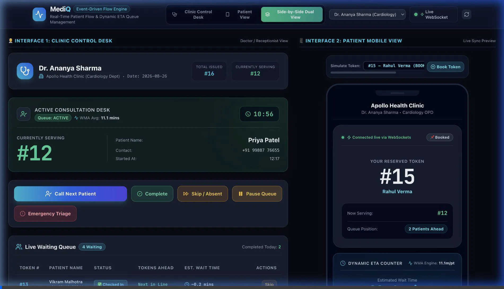
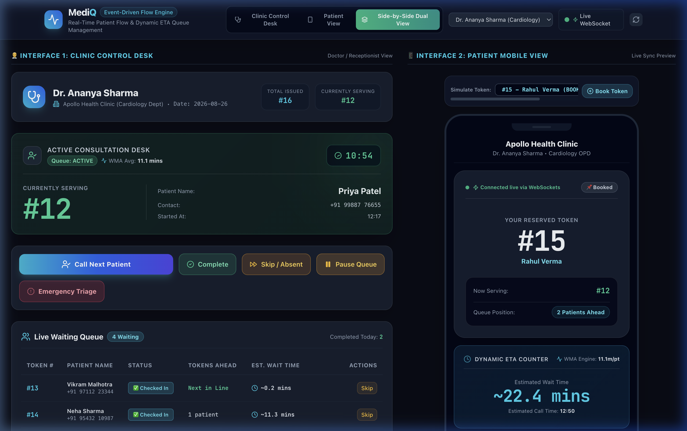
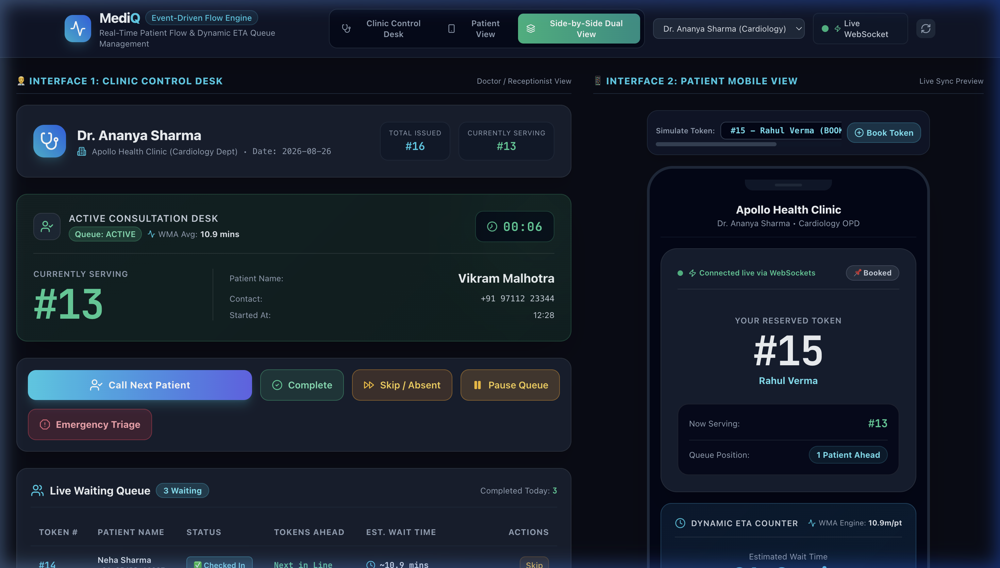
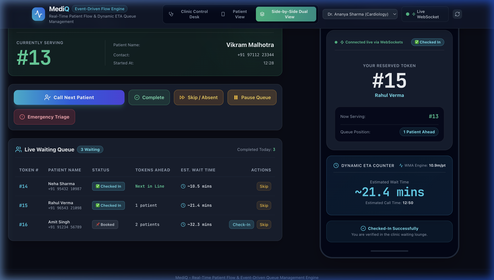
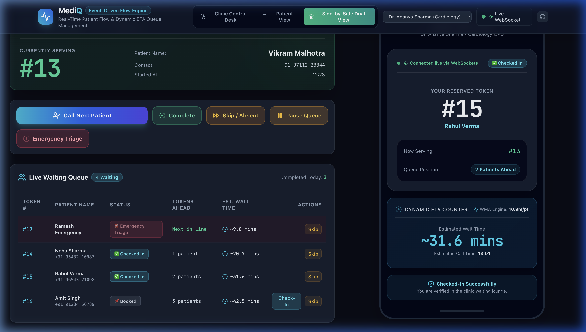
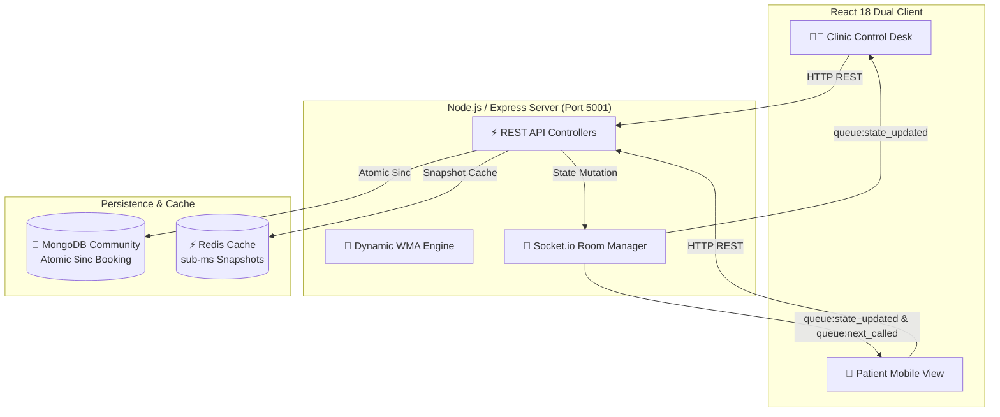

<div align="center">

  <h1>🏥 MediQ</h1>
  <h3>Real-Time Patient Flow & Event-Driven Queue Management Engine</h3>

  <p>
    An enterprise-grade, high-concurrency event-driven OPD queue management system powered by 
    <b>Node.js, Express, Socket.io, MongoDB, Redis, React, and Tailwind CSS</b>.
  </p>

  <p>
    <a href="https://nodejs.org"></a>
    <a href="https://expressjs.com"></a>
    <a href="https://socket.io"></a>
    <a href="https://www.mongodb.com"></a>
    <a href="https://redis.io"></a>
    <a href="https://reactjs.org"></a>
    <a href="https://tailwindcss.com"></a>
    <a href="./LICENSE"></a>
  </p>

  <br />

  <a href="#-live-demonstration"><strong>📹 Watch Live Demo</strong></a> •
  <a href="#-key-features"><strong>✨ Key Features</strong></a> •
  <a href="#-system-architecture"><strong>📐 Architecture</strong></a> •
  <a href="#-quick-start-guide"><strong>🚀 Quick Start</strong></a> •
  <a href="./docs"><strong>📚 Full Documentation</strong></a>

</div>

<br />

---

## 📹 Live Demonstration

> **Watch real-time WebSocket synchronization in action**: Clicking *"Call Next Patient"* on the **Clinic Control Desk** (left) immediately updates the **Patient Mobile Card** (right) live over WebSockets without any page refreshes!



---

## 📚 Technical Documentation Index

Detailed technical specifications and design documents are available in the [`docs/`](./docs) folder:

- 📌 [**Project Details & Domain Context**](./docs/PROJECT_DETAILS.md): Problem statement, OPD queue challenges, core objectives, and user workflows.
- 📐 [**Technical Specifications & System Architecture**](./docs/TECHNICAL_DETAILS.md): Database schemas, atomic `$inc` concurrency algorithms, WMA math breakdown, Redis caching strategy, REST endpoints, and Socket.io events.
- 💻 [**Technology Stack & Layout**](./docs/TECH_STACK.md): Full breakdown of backend, frontend, database, fallback engines, and monorepo structure.
- 🚀 [**Completed Accomplishments & Roadmap**](./docs/COMPLETED_AND_ROADMAP.md): Detailed summary of completed MVP features (Phase 1) and future roadmap (Phase 2 & 3).

---

## ✨ Key Features & Screenshots

### 1. ⚡ Side-by-Side Dual View Mode
Simultaneously view the **Clinic Control Desk** (Doctor/Receptionist) and the **Patient Mobile View** on a single screen to experience sub-second real-time event synchronization.



---

### 2. 👨‍⚕️ Clinic Control Desk & Ticking Stopwatch
Doctors have access to a live consultation stopwatch ticking in `mm:ss`, Weighted Moving Average (WMA) average duration indicator, and one-click action controls (**Call Next**, **Complete**, **Skip**, **Pause/Resume**, and **Emergency Triage**).



---

### 3. 📱 Patient Mobile View & Dynamic ETA Counter
Patients view their personal token card with a live *"Now Serving"* indicator, *"X Patients Ahead"* counter, dynamic live wait time estimate (*"Estimated Wait: ~18 mins"*), and a one-click **Self Check-In** button.



---

### 4. 🚨 Emergency Triage Priority Insertion
Receptionists or doctors can insert urgent triage patients immediately behind the active consultation with **Priority Score 100**, automatically updating position order and triggering instant room alerts.



---

### 5. 🛡️ Zero-Friction Automatic Fallback
No local database daemons running? No problem! MediQ includes an intelligent fallback mechanism:
- **MongoDB**: Automatically connects to native MongoDB (`mongodb://127.0.0.1:27017`). If unreachable, transparently spins up `mongodb-memory-server`.
- **Redis**: Connects to native Redis (`redis://127.0.0.1:6379`). If unreachable, transparently falls back to `ioredis-mock`.

---

## 📐 System Architecture



---

## 🧮 Dynamic ETA Engine Math

Rather than relying on static estimates, MediQ calculates a **Weighted Moving Average (WMA)** of a doctor's recent consultation durations:

$$WMA = 0.1 \times d_1 + 0.2 \times d_2 + 0.3 \times d_3 + 0.4 \times d_4$$

For any token $K$ at position $i$ in line (0-indexed):

$$\text{Active Remaining Time} = \max\left(0, WMA - \frac{\text{Now} - \text{StartTime}_{\text{active}}}{60000}\right)$$

$$\text{Dynamic ETA (mins)} = (i \times WMA) + \text{Active Remaining Time}$$

---

## 📡 API & WebSocket Event Reference

### REST Endpoints (`/api/queue`)

| Endpoint | Method | Description |
|---|---|---|
| `/state/:doctorId` | GET | Returns full queue state snapshot with calculated ETAs |
| `/book` | POST | Atomically books a new token using MongoDB `$inc` |
| `/checkin` | POST | Confirms patient arrival check-in timestamp |
| `/next` | POST | Calls next patient in priority order (Emergency > Checked-In > Booked) |
| `/complete` | POST | Completes active consultation and recalculates WMA |
| `/skip` | POST | Moves absent patient to skipped buffer |
| `/emergency` | POST | Inserts urgent patient with Priority Score 100 |
| `/toggle-pause` | POST | Toggles queue between `ACTIVE` and `PAUSED` |

### Real-Time Socket.io Events

| Event Name | Type | Description |
|---|---|---|
| `join_doctor_room` | Incoming | Subscribes client socket to doctor room |
| `queue:state_updated` | Broadcast | Emits fresh full state snapshot to all room clients |
| `queue:next_called` | Broadcast | Emits alert payload when doctor calls next token |
| `queue:emergency_alert` | Broadcast | Emits alert toast when emergency triage is inserted |
| `queue:eta_updated` | Broadcast | Emits live updated ETAs when consultation completes |

---

## 🚀 Quick Start Guide

### Prerequisites
- **Node.js**: v18.0.0 or higher (v25.6 recommended)
- **npm**: v9.0.0 or higher
- *(Optional)* Homebrew for native MongoDB & Redis services

### 1. Clone & Install Dependencies

```bash
git clone https://github.com/meamritanshu/Real-Time-Patient-Flow-Event-Driven-Queue-Management.git
cd Real-Time-Patient-Flow-Event-Driven-Queue-Management
npm run install:all
```

### 2. Start Native Database Services (Optional)

```bash
brew services start mongodb/brew/mongodb-community
brew services start redis
```
*(If native services are not started, MediQ will automatically fall back to MongoMemoryServer and ioredis-mock).*

### 3. Seed Mock Data
Seed realistic mock queue data for `dr_sharma_01` (Dr. Ananya Sharma, Cardiology):

```bash
npm run seed
```

### 4. Launch Application

```bash
npm run dev
```

Visit the application in your browser:
- **Frontend App**: `http://localhost:5173`
- **Backend API**: `http://localhost:5001/health`

---

## 🧪 Running Component Scripts

```bash
# Run backend server only
npm run dev:server

# Run frontend client only
npm run dev:client

# Seed database
npm run seed
```

---

## 📜 License

Distributed under the **MIT License**. See [`LICENSE`](./LICENSE) for details.
